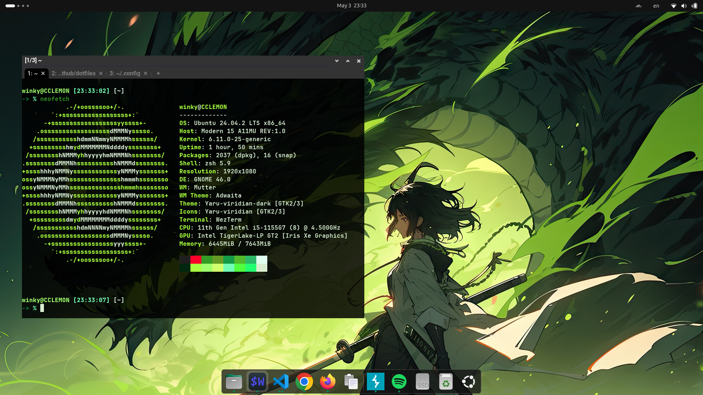
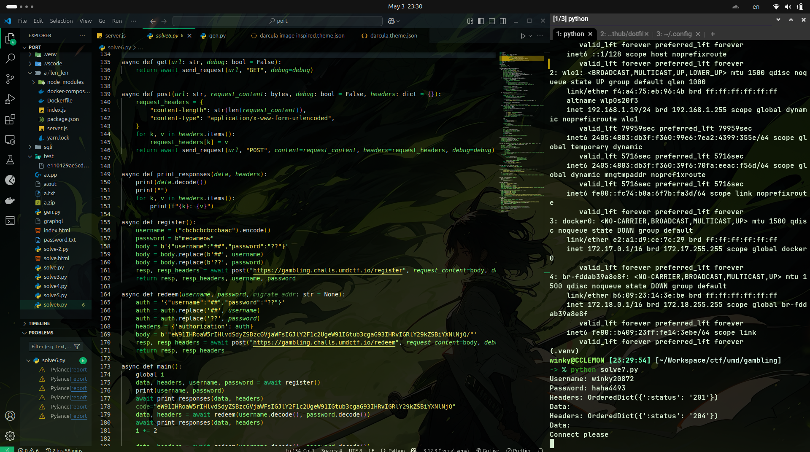
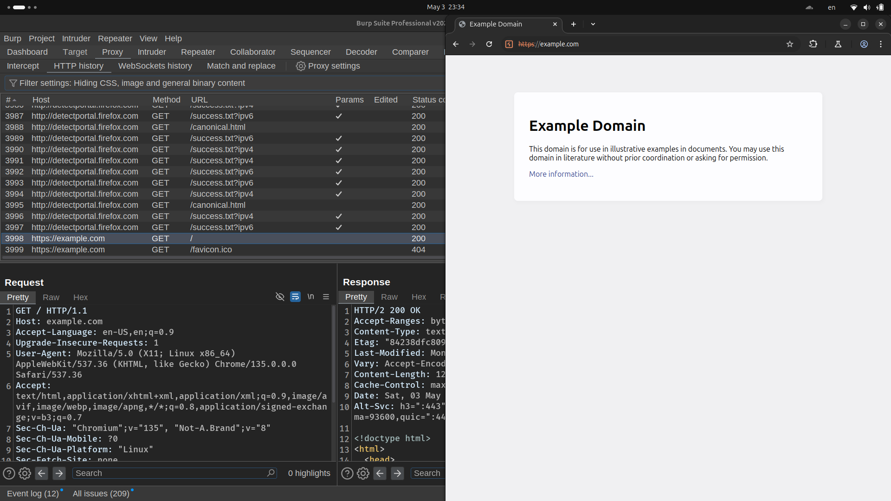

<h2 align="center">My ubuntu dotfiles</h2>

### Images

### Overview
| Type          | Package name                                                                                  |
| :------------ |:----------------------------------------------------------------------------------------------|
| Color scheme  | [Yaru-viridian-dark](https://www.gnome-look.org/p/1252100/)                                        |
|Desktop Environment | [GNOME](https://www.gnome.org/)    |
| Window manager            | [Mutter](https://mutter.gnome.org/)                                               |
| Shell         | [zsh](https://zsh.sourceforge.io/)                                                            |                       |
| Terminal      | [wezterm](https://wezterm.org/)                                                  |
| Text editor   | [neovim](https://github.com/neovim/neovim/), [vscode](https://github.com/microsoft/vscode)     |
|File Manager|[nautilus](https://apps.gnome.org/Nautilus/)|
|Keyboard|[ibus-unikey](https://github.com/vn-input/ibus-unikey)|